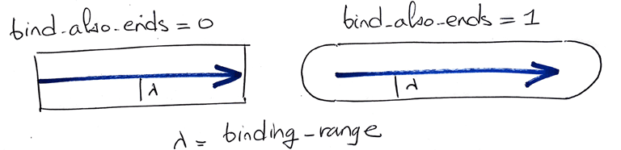
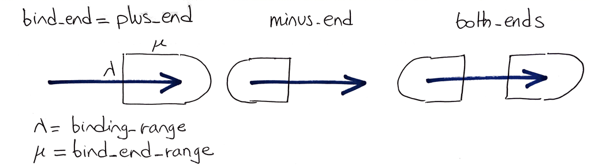
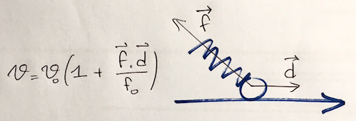

# Tutorial 1: Introduction to Cytosim

Authors: Francois Nedelec (2002-2017), Beat Rupp (Oct 9, 2009), Sven Mesecke (Sep 12, 2013), Julio Belmonte (Sep 2017)

## Objective

This tutorial provides a step-by-step introduction to Cytosim starting from the beginning.
It only requires `play` and introduces some of the most fundamental objects found in Cytosim,
such as `fiber`, `hand` and `single`.

## Preamble

Here is how you will run the simulations:

1. Create a new directory and perform all tasks within this directory.
2. Copy the `play` executable from Cytosim.
3. Copy the example configuration to a file named `config.cym`
4. In the console type `./play live` and press `enter`. This will start a live simulation, that will read its instructions from `config.cym`.

At any time, you can restart the simulation by pressing `z` on the keyboard. This should also be done if you change the configuration file, e.g. as you progress through the tutorial.
The configuration file `config.cym` for Cytosim is a plain text file, and should be edited using a PLAIN text editor. You can use TextEdit, Geany, TextMate or any 'text code' editor, but do not use MS Word or Pages. 

## Step 1 - The configuration file

Cytosim reads a single configuration file, and executes its commands in the natural order, from top to bottom. By default, the configuration file is named `config.cym`.
Let's start with a minimal configuration file. A square "cell" is defined, but it is kept empty.
It is simulated for 1 second, and nothing happens.

    set simul tutorial
    {
        time_step = 0.01
    }
    
    set space cell 
    {
        geometry = rectangle 10 10
    }
    
    new space cell
    
    run 100 simul *
    {
        nb_frames = 50
    }

The first 3 commands define the minimal components that are necessary to run a simulation with Cytosim.
The command `set` defines classes of objects, and `new` creates the objects following these classes. More in detail:

    set simul tutorial
    {
        time_step = 0.01
    }

defines the name of the simulation (*tutorial*), and sets the time step to 0.01 seconds.

    set space cell
    {
        geometry = rectangle 10 10
    }

defines a rectangular space named *cell* with dimensions `W = 10` and `H = 10` micrometers. The entire box is actually `2W` wide, and `2H` high, and the origin is placed in the center.

Finally:

    run 100 simul *
    {
        nb_frames = 50
    }

instructs cytosim to simulate the system. Specifically, it will perform 100 iterations, and hence simulate a total time of `100 * 0.01 = 1 second`.  It will also record 50 frames at equal intervals, so in this case every 1 / 50 = 0.02 second.

## Step 2 - Diffusing particule

Let's add a diffusing particle to the "cell":

    set simul tutorial
    {
        time_step = 0.01
    }
    
    set space cell 
    {
        geometry = rectangle 10 10
    }
    
    new space cell
    
    set hand kinesin
    {    
    }
    
    set single particle
    {
        hand = kinesin
        diffusion = 10
    }
    
    new 1 single particle
    
    run 100 simul *
    {
        nb_frames = 50
    }

The new object is defined by two `set` and created by `new`:

    set hand kinesin
    {
    }

defines a new class of *Hand*, which is an object that can bind to a fiber. 
This new objection is called *kinesin*, but we could have used any other name.
For now, the space within the brackets was left blank, intentionally. Hence the binding rate was not defined, and since it is equal to zero by default, the kinesin that we have defined will not bind.
In addition, the simulation does not contain any fiber yet, so there is nothing it could bind to.

An object of class *Hand* cannot be created directly, and must be included in another class: *single* or *couple*. Here, we define a *single* called "particle" that contains one *kinesin*:

    set single particle
    {
        hand = kinesin
        diffusion = 10
    }

A *single* is a point-like particle, that has a position in space but no orientation. It will diffuse freely within the *space* as long as it is not bound to any filament.
The parameter `diffusion = 10` in this section defines the [diffusion coefficient](http://en.wikipedia.org/wiki/Mass_diffusivity) in units of micro-meter squared per second (um^2/s). This is a typical value for a protein in the cytoplasm.

The next command creates one of these *particle*:

    new 1 single particle

By running the simulation (`play live`), you should see now that the particle is freely diffusing inside the rectangle that was defined in *cell*. We will now see some of these parameters in more detail. 

### Changing the number of particles

You can increase the number of particles by editing `config.cym`, to change the `new` command:

    new 100 single particle
    
Do not forget to save the file `config.cym` and to run `sim` again. This will erase any previous results.
The simulation now has 100 particles... They are set initially uniformly and randomly inside the box, and all diffuse freely with the same diffusion coefficient.

### Changing the diffusion constant

You can change the diffusion constant of the particles, or any other parameter in the same way:

    set single particle
    {
        hand = kinesin
        diffusion = 0.1
    }

The diffusion coefficient has been reduced to 0.1 micro-meters squared per seconds... and the particles now diffuse very slowly. There is no interaction between them, and they bounce off the walls of the *cell*.

### Defining the initial position of the particles

We can start the simulation with all the particles in the center:

    new 100 single particle
    {
        position = 0 0 0
    }

All the particles are now initially at the origin, and you can see them spread in the live display. The profile of density is Gaussian. You can press 'z' on the keyboard to restart the simulation, and press 's' to stop the animation and trigger individual steps of the simulation.
Cytosim has many options to define the positions of the objects, for example:

    position = X Y Z
    position = surface
    position = edge R
    position = ball R

You can use multiple `new` to define more complex initial conditions:

    new 100 single particle
    {
        position = 0 0 0
    }
    
    new 100 single particle
    {
        position = ball 2
    }

### Change the geometry:

Change the `geometry` parameter to increase the box size to 60 x 60 micro-meters. The points seems to move even  slower on the animation, but this is an impression that is due to the larger field of view of the simulation. The coefficient of diffusion has not changed.
    
Cytosim has a set of simple geometries associated with the `space` class. You can try: 

    set space cell 
    {
        geometry = ( circle 10 )
    }

or

    set space cell 
    {
        geometry = ( capsule 8 2 )
    }

## Step 3 - The time step

One of the most important parameter of the simulation is the time step.
This defines the time interval corresponding to one step of cytosim's engine.
Smaller time step yield more precise results, but consequently a larger number of calculation is needed to simulate the same interval, which requires more CPU time, and you may have to wait for the computer.
The total simulated time can be controlled by the number of iterations:

    set simul tutorial
    {
        time_step = 0.01
    }
    ...
    run 1000 simul *
    {
    }

The simulated time is simply `nb_steps * time_step`, which is here `0.01 * 1000`.
The unit of time in the simulation is the second, and `time_step` should be given in seconds.

### Varying the time step

One of the first control in any simulation is to check that the value of `time_step` does not affect the outcome of the calculation. This should be true as long as `time_step` is small enough. There is generally a certain value below which the numerical precision is sufficient. The value of this threshold is however different for each system, and one may not know it a priori. In fact, it really depends on how you analyze the outcome of the simulation. A usual strategy is then to run two simulations with different time steps, and to compare the outcome. If the result are different, then `time_step` is for sure is too big.
Thus one can reduce the time step until this has no 'noticeable' effect on the outcome.

    set simul tutorial
    {
        time_step = 0.001
    }
    ...
    run 10000 simul *
    {
        nb_frames = 50
    }

Here the `time_step` was reduced by a factor 10, and the number of iterations multiplied by 10, to keep the same amount of total time. 
Is the animation similar to the previous one obtained with the bigger time step?
Can you decrease the time step even further?
Does it take more time to simulate the system?

Note: if you are an experienced UNIX user, you can run two simulations in parallel.

## Step 4 - Filaments

Let's now define [microtubules](http://en.wikipedia.org/wiki/Microtubules)! 

    set simul tutorial
    {
        time_step = 0.01
        viscosity = 1
        kT = 0.0042
    }
    
    set space cell 
    { 
        geometry = ( circle 5 )
    }
    
    new space cell
    
    set fiber microtubule
    {
        rigidity = 20
        segmentation = 1
        confine = inside, 100
    }
    
    new 1 fiber microtubule
    {
        length = 4
    }
    
    run 10000 simul *
    {
        nb_frames = 50
    }

Here, we have defined a type of fiber named `microtubule` with a bending elastic modulus of 20 pN.um^2, which is a realistic value for microtubules.
One filament is created by `new` with a length of 4 um.

### Viscosity

Reduce the length of the filament to a small value such that it does not touch the box, and place it horizontally in the center:
    
    new fiber microtubule
    {
        length = 2
        position = 0 0 0
        orientation = 1 0 0
    }
    
Here, `orientation` should be a vector that indicate the direction of the filament. In this case, `1 0 0` is a horizontal vector pointing right.

For cytoskeletal filaments, the dominating forces are usually the [Brownian motion](http://en.wikipedia.org/wiki/Brownian_motion), and the viscous drag induced by motion in the fluid. The parameter `viscosity` sets the [viscosity](http://en.wikipedia.org/wiki/Viscosity) of the surrounding fluid. In the units of the simulations, water has viscosity 0.001. The viscosity is here set to 1, which would be appropriate for simulating the cytoplasm inside the cell (what is exactly the viscosity of the cytoplasm is a tricky issue that we cannot discuss here).

In the model, the drag is linear in the length of the microtubule. Longer ones are more difficult to move than shorter ones. The drag coefficient is calculated using a formula similar to Stoke's law, but which is derived for a cylinder instead of a sphere.

Diffusion is calculated from the drag coefficient, using the [Einstein relation](http://en.wikipedia.org/wiki/Einstein_relation_%28kinetic_theory%29). The filament is diffusing both in translation and rotation, but this is usually quite slow. Temperature is set by kT, with 0.0042 corresponding to room temperature (kT ~ 4.2 pN.nm). 

### Segmentation

To calculate their motion, Cytosim subdivides the filaments into segments of equal length. The parameter `segmentation` sets the preferred length of these segments. For example, the filaments are here discretized every 1 micro-meter. A 4 micro-meter long microtubule is represented by 5 points.
You can reduce the segmentation to model the microtubule more precisely:

    set fiber microtubule
    {
        ...
        segmentation = 0.2
    }

A finer discretization gives more precision, but this may not always be very useful, because the added precision is smaller than the thermal noise due to Brownian motion. Press ''1'' to cycle through different visualization styles for the microtubules to see the effect.
Adapting the segmentation is however essential if you reduce the bending elasticity to make the filament more floppy. Try reducing the microtubule bending elasticity from 20 to 1 pN.umˆ2, while keeping the segmentation size equal to 1 um:

    set fiber microtubule
    {
        rigidity = 1
        segmentation = 1
        confine = inside, 100
    }
    
With such a long `segmentation`, kinks may become apparent as the line describing the filament is not smooth anymore.
You can fix this problem by reducing the `segmentation` parameter at the same time as the bending elasticity:

    set fiber microtubule
    {
        rigidity = 1
        segmentation = 0.2
        confine = inside, 100
    }
    
Lower values of the `segmentation` incurs more points in the model, and the simulation thus takes more time to compute.

### Initial length

The parameter `length = 4` within the `new` block defines the initial length of the microtubule. The microtubules bend here under the action of thermal activation, but this is hardly noticable. Indeed, microtubules are quite rigid, and their measured persistence length is of a few millimeters, about 100 times longer than the length here!

Observe what happens when you increase the length of the filament until they do not fit in the cell anymore.

    new 1 fiber microtubule
    {
        length = 12
    }

Cytosim has some (limited) options to generate a random length on the fly, such as to generate a exponentially distributed length distribution. This is especially useful if you create many filaments:

    new 100 fiber microtubule
    {
        length = 10, exponential
    }

### Confinement

These filaments are confined inside the *cell* with a stiffness `k = 100 pN/um`:

    set fiber microtubule
    {
        confine = inside, 100
    }

With a lower value of the confinement stiffness `k`, the filament will appear to stick out of the box.

    set fiber microtubule
    {
        confine = inside, 1
    }

This is expected, since the confiment is 'soft' and implemented with an Harmonic potential, which gives rises to a linear force. Hence if the filament sticks out by a distance `x` the force is `k*x`. This force is always directed perpendicular to the edge of the box, and thus corresponds to a frictionless boundary.

In this case, the controlling parameter is the ratio of bending elasticity to confinement elasticity.

## Step 5 - Microtubule-binding molecules 

Let's make the `kinesin` able to bind microtubule. We need to define two properties for binding, and two more for unbinding:

    ...
    set hand kinesin
    {
        binding_rate = 10
        binding_range = 0.01
        unbinding_rate = 1
        unbinding_force = 3

        display = ( color=yellow; size=4; )
    }
    
    set single particle
    {
        hand = kinesin
        diffusion = 10
    }
    
    new 1000 single particle
    
Remember that the "kinesin" is of class *hand* and cannot exist by itself. It must be a part of a *single* or a *couple*. Here, the particle is defined as a *single* and it will thus contain one "kinesin". The "kinesin" is not yet able to move, but it can bind and unbind, as we defined:

* `binding_range` and `binding_rate` are used to calculate the attachement of Hands onto filaments. A hand has a probability `binding_rate` per second to bind to any filament closer than `binding_range` (micro-meter) away.
* `unbinding_rate` sets the frequencies per second at which attached Hands detach.
* `unbinding_force` is the characteristic force of the motor for detachment under load (in pN). The detachment rate increases exponentially with the norm of the experienced force: 

        unbinding_rate * exp(|force|/unbinding_force)

Finally, we have specified that each "kinesin" should be displayed as a yellow dot of size 4 pixels. Choosing different colors is very helpful if you want to define multiple types of hands.

Do you see the molecules binding and unbinding from the filaments?
Press `i` three times in the keyboard to display information about the states of the singles during the simulation.

### Visualizing binding events

We can visually check that attachments are calculated correctly. 
We set here a simulation where the diffusion of motors is set to zero, and `binding_range` is set to a high value. The viscosity is set very high to reduce the motion of the filament.
As particles bind, this progressively clears the space.

    set simul test
    {
        time_step = 0.01
        viscosity = 5
    }
    
    set space cell 
    { 
        geometry = ( circle 5 )
    }
    
    new space cell
    
    set fiber microtubule
    {
        rigidity = 20
        segmentation = 0.5
        confine = inside, 100
    }
    
    new 3 fiber microtubule
    {
        length = 7
    }
    
    set hand kinesin
    {
        binding_rate = 10
        binding_range = 0.1
        unbinding_rate = 0.1
        unbinding_force = 3

        display = ( color=yellow; size=4; )
    }
    
    set single particle
    {
        hand = kinesin
        diffusion = 0
    }
    
    new 65000 single particle
    
    run 10000 simul *
    {
        nb_frames = 50
    }

Any Hand can bind with a rate `binding_rate` per seconds to every filament closer than `binding_range`. If it binds, a Hand does so always to the closest position on a filament. The regions where particles are close to two or more filaments clear up faster. 

### End-binding

By default hands will bind only to the side of the filaments, but the capture region can be extended with the parameter `bind_also_ends`. 

    set hand kinesin
    {
        ...
        bind_also_end = 1
        ...
    }
    
* `bind_also_end` is a binary parameter that can be 0 or 1.

It extends the capture region to allow binding to the end:

### End-binding

By default hands can bind anywhere in the filament, but you can restrict the binding site to a region near the filament ends. 
All fiber objects in cytosim have an intrinsic polarity, with a plus-end and minus-end. These ends can have different properties. Dynamic microtubles, for example, grow and shrink primarily from the plus-ends.
The specification of the binding site of a hand is done with `activity = track`:

    set hand kinesin
    {
        ...
        activity = track
        bind_end = plus_end
        bind_end_range = 0.5
    }
    
* `bind_end` restricts the binding site to the ends (see below).
* `bind_end_range` specifies the maximum distance from the ends to which it can bind.

The possible values for `bind_end` are `plus_end`, `minus_end` and `both_ends`:

Add these features to the last example and check the difference.

## Step 6 - Molecular motors 

Let's make our *kinesin* behave like a [molecular motor](http://en.wikipedia.org/wiki/Molecular_motor):
This is done by specifying an activity, and adding the necessary parameters for this activity:

    set hand kinesin
    {
        ...
        activity = move
        max_speed = 1
        stall_force = 5
    }
    
* `activity = move` defines it to be a molecular motor that is able to move on the fibers
* `max_speed` sets the speed of motion while bound on the microtubule. In the model, plus-end directed motor have positive speeds, and minus-end directed ones have negative speeds.
* `stall_force` is the characteristic force at which the motor will stop moving under load (in pN)

Do you see the motors moving?

The movement of bound motors is more apparent on a larger time scale, such as 10 seconds, and you should set the number of steps accordingly. 

### Processivity

The motors stay bound on average for `1 / unbinding_rate` seconds, during which they move by a distance `max_speed / unbinding_rate` micro-meters, here roughly 1 micro-meter. 
This distance is informally called the processivity of the motor. You can increase it by decreasing the unbinding rate:

    set hand kinesin
    {
        ...
        unbinding_rate = 0.1
        ...
    }

If the detachment rate `unbinding_rate` is very low, motors walk for a very long time, and are said to be very processive. Here they would walk on average for 10 micro-meters, but they usually reach the end of the filament before, where they unbind immediately. 

### Directionality

We can change the direction in which the motor move, by changing the speed which can be positive or negative.
Define another type of hands, a "dynein" that goes to the minus-end of microtubules:

* Copy-paste the entire `set hand kinesin` paragraph,
* Change "kinesin" into "dynein",
* Set a negative speed (e.g. -1).

The result will be a new definition:

    set hand dynein
    {
        ...
        activity = move
        max_speed = -1
        stall_force = 5
    }

If `max_speed` is set positive, the motor walks towards the plus-end of the microtubules. If `max_speed` is set negative, the motor walks towards the minus-end of the microtubule. 

In Cytosim, motors moving in opposite directions do not collide, and instead pass through each other like fantoms. 
Can you check this by defining two classes of motors?

### Force-velocity relationship

Cytosim implements a linear force-velocity relationship, as measured for conventional kinesin. The speed of a motor is affected by the force that it experiences.
The speed is calculated given the external force `f` and the direction `d` in which the motor would move on the filament if it was free. In this formula, `f_0` is the stall force and `v_0` is the max_speed. Note that `d` is a unit vector parallel to the filament, pointing either toward the plus end or the minus end, depending on the directionality of the motor. The 'dot' is the scalar product between the two vectors, which is negative in this configuration.

### What happens when a motor reaches the end of a filament?

Because it is moving, a motor may reach the end of a filament. It may then either stall, or unbind immediately. A motor will likely not stall forever, but its unbinding rate in the dangling configuration can be different from the unbinding rate that it had while it was moving. 
The behavior of the motor upon reaching the end of a filament has a strong influence on the type of patterns that motor may impose to microtubules. If the motor is able to stall, radial patterns called aster may arise, but this is unlikely if the motor detach immediately. 

In cytosim, this property of the motor is controlled by a specific parameter: 

    set hand dynein
    {
        ...
        activity = move
        hold_growing_end = 1
    }

Do you see a difference with the default behavior (`hold_growing_end = 0`)? 

## The end

Congratulation, you have completed the tutorial. If you have suggestions on this material, please email us at *feedback AT cytosim.org*

