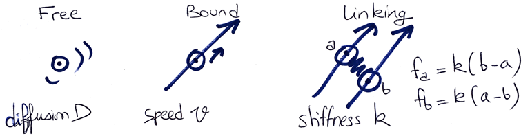

# Tutorial 2: Self-organization of Microtubules and Motors

Authors: Francois Nedelec (16.09.2017)

## Objective

This tutorial is directly inspired by a series of in-vitro work in which a mixture of purified [molecular motors](http://en.wikipedia.org/wiki/Molecular_motor) and [microtubules](https://en.wikipedia.org/wiki/Microtubule) self-organize into regular patterns.

For more information on this work, see:
> [Self-organization of microtubules and motors](http://www.cytosim.org/publications/pdf/nedelec1997.pdf)
>
> Nedelec F, Surrey T, Maggs A.C. and Leibler S. --- Nature 389: 305-308; 1997.
>
> [Physical properties determining self-organization of motors and microtubules](http://www.cytosim.org/publications/pdf/surrey2001.pdf)
> 
> Surrey T, Nedelec F, Leibler S. and Karsenti E. --- Science 292: 1167-1171; 2001.

## Preamble

This tutorial should be done in 2D using `play`, by manually editing the configuration file. You can copy-paste the commands directly from this file into `config.cym` in your text editor.

You have already followed Tutorial 1, and you should be familiar with the general syntax of Cytosim's configuration files, and be able to run a live simulation from the command-line.

# Step 1: Microtubules

You can start with [this configuration file](data/self.cym). 
Let's see what this files contains.
It defines a circular cell of radius 10 um: 

	set simul self 
	{
	    time_step = 0.01
	    viscosity = 0.05
	    display = ( style=2; )
	}
	
	set space cell
	{
	    geometry = ( circle 10 )
	}
	
	new space cell

It defines a class of fibers called *microtubule*:
	
	set fiber microtubule
	{
	    rigidity = 20
	    segmentation = 0.5
	    confine = inside, 100
	    display = ( line_width=1; end_style=2; )
	}

* `rigidity` is the bending elastic modululus (pN.um^2 )
* `segmentation` defines the length at which filaments are subdivided in the simulation.
* `confine = inside` sets that filaments are confined within the cell, here with a stiffness of 100 um/pN.
* `display` sets the visualization option for the microtubules. Here the lines have a width of 1 and the option `end_style=2` displays the plus-end of the microtubule.

Finally, it create 80 *microtubules* with length 14 um:

	new 100 fiber microtubule
	{
	    length = 9
	}
	
To complete the configuration, add a command to simulate the system:

	run simul *
	{
	    nb_frames = 50
	    nb_steps = 5000
	}

Specifically, it will perform 5000 iterations, and hence simulate a total time of `5000 * 0.01 = 50 second`.  It will also record 50 frames at equal intervals, so in this case every 1 second.

By running the simulation (`play live`), you should direclty see a graphical representation of the system.
Check now that you are able to run the simulation live, and see the system evolve.

We will now see some of the parameters in more detail. 
 
### Initial position of microtubules

By default, these filaments are positionned randomly in position and direction.
Check how this looks, and vary the number of filaments and their length.
You can also set their position exactly:

	new 100 fiber microtubule
	{
	    length = 9
	    position = 1 0
	}

You can use multiple `new` to create more complex patterns, like this one:
	
	new 50 fiber microtubule
	{
	    length = 9
	    orientation = horizontal
	}
	new 50 fiber microtubule
	{
	    length = 9
	    orientation = vertical
	}

Take some time to become familiar with this approach, and try different combinations of parameters.

# Step 2: Molecular motors

A molecular motors is a specialization of a more general class called `hand`, which are molecules that can bind to filaments. We define here here a `hand` called *kinesin*:

	set hand kinesin
	{
	    binding_rate = 10
	    binding_range = 0.01
	    unbinding_rate = 0.1
	    unbinding_force = 3
	    
	    activity = move
	    max_speed = 0.8
	    stall_force = 5
	
	    bind_also_end = 1
	    hold_growing_end = 1
	
	    display = ( color=orange; size=7; width=7; )
	}

The first set of parameters define the binding and unbinding properties.

* `activity = move` defines it to be a molecular motor that is able to move on the fibers
* `max_speed` sets the speed of motion while bound on the microtubule. In the model, plus-end directed motor have positive speeds, and minus-end directed ones have negative speeds.
* `stall_force` is the characteristic force at which the motor will stop moving under load (in pN)

The last parameters define the behavior of the motor with respect to the end of microtubule:

* `bind_also_end = 1` will allow the motors to bind directly to the end of the microtubules, and not only to the side.
* with `hold_growing_end = 1`, motors that reach the end of a microtubules, by their movements, will stay there.

## Motile particles

To check that the motors are behaving as expected, we will first create a motile particle that contains one motor. This is done with the class `single`:

    set single particle
    {
        hand = kinesin
        diffusion = 1
    }
    
    new 1000 single particle

Here the diffusion constant is `1 um^2/s`. This is in the lower range of the physiological values, but it makes things easier to see.

With this setup, do you see the motor diffusing, binding and moving along microtubules? Use a lower number of microtubules to better visualise the motors moving along the fibers.

Change `max_speed` to a lower value, and to a negative value to define a minus-end directed motor.

### Change the diffusion constant

Reduce the diffusion constant of the particles:

    set single particle
    {
        hand = kinesin
        diffusion = 0.1
    }

With this lower value, the complexes diffuse now very slowly. There is no interaction between them, but they bounce off the walls of the box.

### Initial position of motors

To start the simulation with all the particles in the center, use this:

    new 100 single particle
    {
        position = 0 0 0
    }

This will not affect the system much, provided the diffusion constant is high enough.

Remove the microtubules (new 0 fiber microtuble) and try this configuration. How much time is required until the motor distribute uniformly?

# Step 3: Complexes of multiple motors

To organize microtubules, we need a motor *complex* that is able to bind two microtubules at the same time. We define such a complex with the class `couple`:

	set couple complex
	{
	    hand1 = kinesin
	    hand2 = kinesin
	    stiffness = 100
	    diffusion = 10
        length = 0.01
	}

The *complex* are made of two identical *kinesin*.
Each hand can bind and move on a microtubule independently. 
There are thus 3 possible states for a *couple*:

* Free: both *hands* are unattached,
* Bound: one *hand* is attached, and not the other one
* Linking: both *hands* are attached
 
Generally the *couple* behaves according to its state:
 
* Free: the *couple* is diffusing and both *hands* are trying to bind filaments,
* Bound: the *couple* is located at the attachement point on the filaments,
* Linking: the *couple* is acting as a Hookean spring between the two filaments.

The parameters are:

* `diffusion ` the diffusion constant (um^2/s), of a *free couple*.
* `stiffness` for the link that is created between two microtubules, by a *linking couple*.

In the *bound* state, the movements of the couple is defined by the *hand* that is bound.

Make a simulation with two microtubles at the center of the cell and add a 10 of these complexes. Did they have any effect on the position or orientation of them?

# Step 4: Self-organization

Create 100 microtubules of length 9 um randomly distributed in the cell and add 1000 *complex* to it:

	new 1000 couple complex

With this setup, do you see *complex* binding two microtubles?

What is the effect on microtubules? 

Do you see any sign of self-organization?

## How motors behave at the end of microtubules

Two parameters of the *hand* have a great influence on the outcome of the simulation:

* `bind_also_end = 1` will allow the motors to bind directly to the end of the microtubules, and not only to the side.
* with `hold_growing_end = 1`, motors reaching the end of a microtubule, by their movements, will stay there.

Setting `bind_also_ends=1` extends the the capture region of the filaments: 

What is the effect of changing these values on the outcome of self-organization?

Tip: start by changing both values to zero, as the effect is more dramatic.

## Influence of cell size

The final organization of the filaments is greatly affected by the size of the box.

See if you can reproduce the results observed in vesicles of different sizes:

> [Effects of confinement on the self-organization of microtubules and motors](http://www.cytosim.org/publications/pdf/pinot2009.pdf)
> 
> Pinot M, Chesnel F, Kubiak JZ, Arnal I, Nedelec F, Gueroui Z --- Current Biology 19 (11), 954-960, May 2009.

Can you reproduce these results by changing the radius of the box?

    set space cell 
    {
        geometry = ( circle 8 )
    }

What determines the transitions between the different type of organizations?

## Influence of cell geometry

Change the `geometry` parameter to increase the box size to 60 x 60 micro-meters. The points seems to move even  slower on the animation, but this is an impression that is due to the larger field of view of the simulation. The coefficient of diffusion has not changed.
    
Cytosim has a set of simple geometries associated with the `space` class. You can try: 

    set space cell 
    {
        geometry = ( circle 10 )
    }

or

    set space cell 
    {
        geometry = ( capsule 8 2 )
    }

# Step 5: Defining multiple types of molecules

It is easy to define a *binder* that does not move. No `activity` should be specified:

	set hand binder
	{
	    binding_rate = 10
	    binding_range = 0.01
	    unbinding_rate = 0.1
	    unbinding_force = 3
	
	    display = ( color=gray; size=7; width=7; )
	}

You can define a slow motor as follows:

    set hand slow_kinesin
    {
        ...
        activity = move
        max_speed = 0.1
        stall_force = 5
        
        display = ( color=red; size=7; width=7; )
    }

If `max_speed` is set positive, the motor walks towards the plus-end of the microtubules. If `max_speed` is set negative, the motor walks towards the minus-end of the microtubule. 

    set hand dynein
    {
        ...
        activity = move
        max_speed = -1
        stall_force = 5
        
        display = ( color=green; size=7; width=7; )
    }

In Cytosim, motors moving in opposite directly never collide, and instead pass through each other like fantoms. Can you check this by defining two class of motors?

### Various complexes

Create different type of `couple` with these hands and check what they do: 

    set couple dynein_complex
    {
        hand1 = dynein
        hand2 = dynein
        diffusion = 10
        stiffness = 100
    }
    
    new 1000 couple dynein_complex

Can you imagine what a complex with both plus- and minus-end directed motor will do?

    set couple binder_kinesin
    {
        hand1 = binder
        hand2 = kinesin
        diffusion = 10
        stiffness = 100
    }
    
    new 1000 couple binder_kinesin
    ...

Try different combinations, guided by your imagination.

Explore mixtures in which different complexes are added.

Do you think these explorations can be automated?

## The end

Congratulation, you have completed the tutorial.

